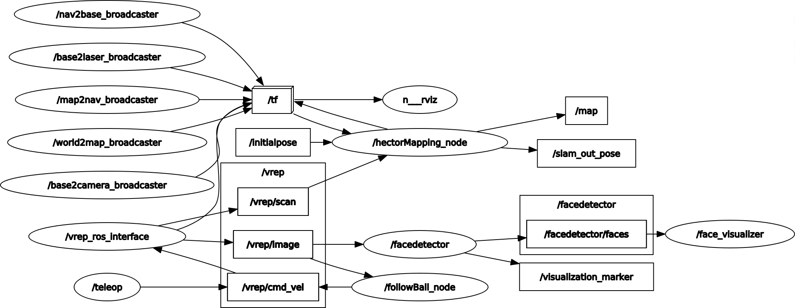
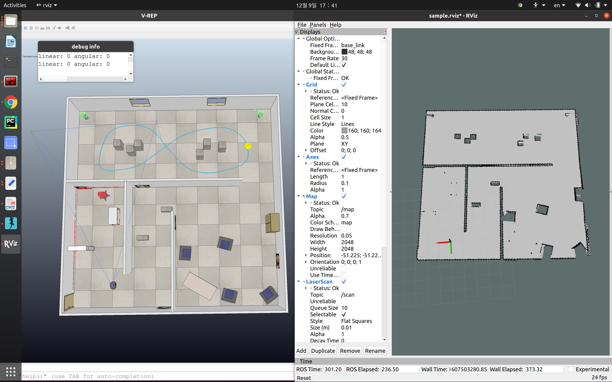
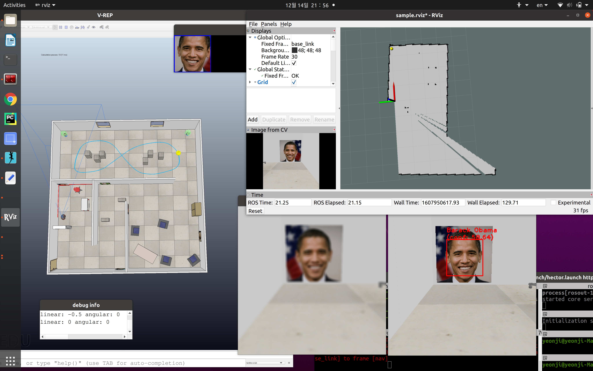

# HKUST ELEC 3210 FALL 2020 FINAL PROJECT


## TASK
* Build 2D grid map with laserscan data avia `rviz`
* Control the mobile robot in the `vrep` simulation environment with keyboard
* Image Recognition and localization
* Visual Servoing (follow the yellow ball)
* Run everything in a single launch file



## PREREQUISITE
1. ROS environment (this repo refers to noetic version)
2. VREP simulator
3. RVIZ package
4. OpenCV packages

## RUN
1. open one terminal and run `$ roscore`
2. open another terminal and run `$ . ~/V-REP/vrep.sh`
3. Once a blank scene in vrep appear, open `env.ttt` and press the start bottom
4. launch the ros nodes for face detection/recognition and automatic ball tracking
```
$ roslaunch hector.launch
```

- For mapping only:
```
$ roslaunch mapping.launch
```


- For face detection only:
```
$ roslaunch detecting.launch
```


- For automatic ball tracking only:
```
$ roslaunch tracking.launch
```


5. Control the robot by keyboard (i j k l ,)

### Credits
* SONG, YeonJi
* This is the final project of the course `ELEC3210: Machine Learning and Information Processing for Robotic Perception` by Prof. LIU Ming in Fall 2020 at HKUST

